# モデルのエンジン内プレビュー

`tools/preview_engine.mjs`が自動生成する(手で編集しない)。
実際のゲームと同じ描画スタック(トゥーンマテリアル・輪郭線・
ポストプロセス)で撮っているので、ゲーム内の見た目と一致する
(plan/models/archive/engine-preview-snapshots.md)。

| モデル | 見た目 |
|---|---|
| akubitokage | 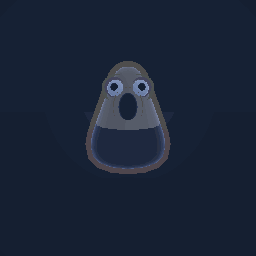 |
| ashiatodori | 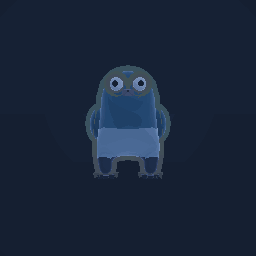 |
| barrel | 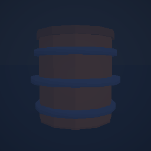 |
| barrel_bomb |  |
| barrel_caught | 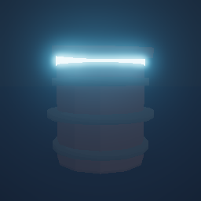 |
| bonfire | 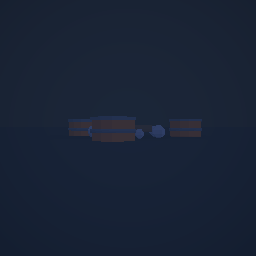 |
| bread | 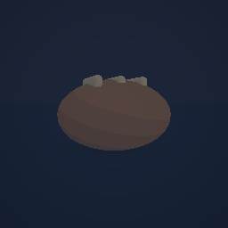 |
| cave_gate | 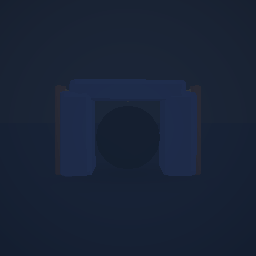 |
| chouchinokuri | 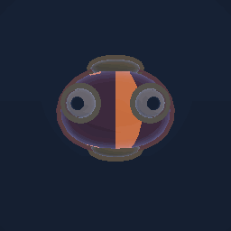 |
| floor |  |
| fuchiNoNushi | 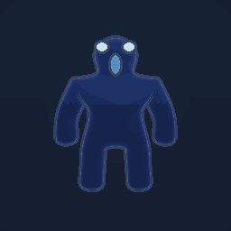 |
| fuku | 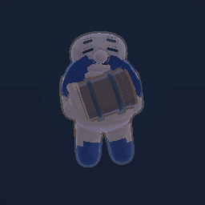 |
| gajiri | 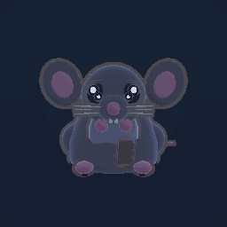 |
| garudo | 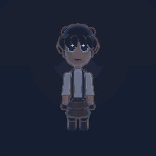 |
| gendo | 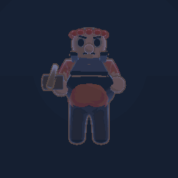 |
| hajimeNoYume | 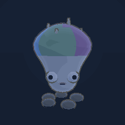 |
| hatchet | 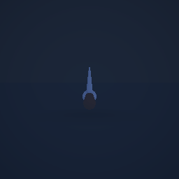 |
| herb | 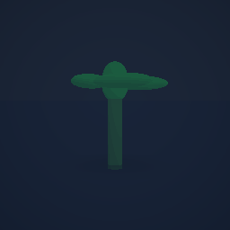 |
| honedatami | 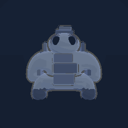 |
| honegarami | 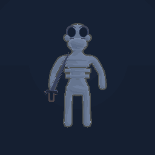 |
| honezukaNoNushi | 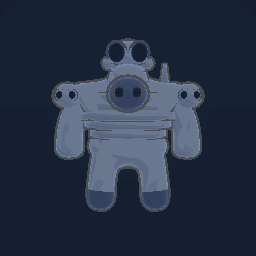 |
| honezukanotsukai | 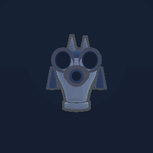 |
| horikuiNoNushi | 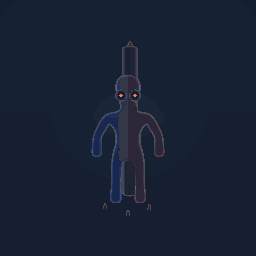 |
| horoholocho | 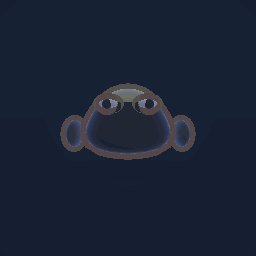 |
| house_compendium | 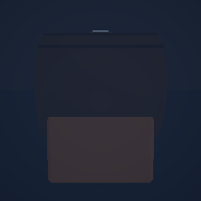 |
| house_development | 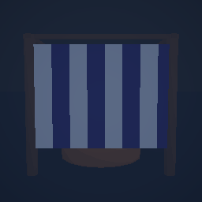 |
| house_garudo | 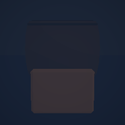 |
| house_hut | 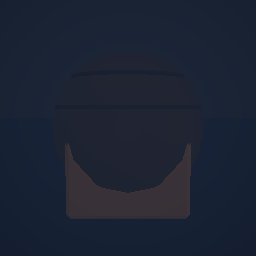 |
| house_records | 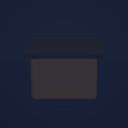 |
| house_storage | 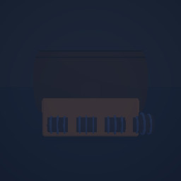 |
| house_workshop | 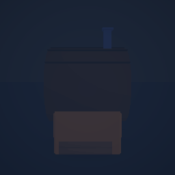 |
| houshitobi | 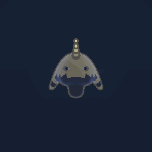 |
| ishizuenezumi | 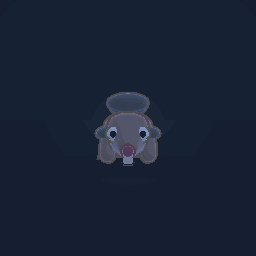 |
| ito | 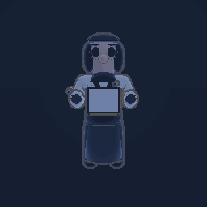 |
| kaerukodama | 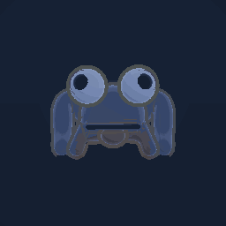 |
| kageboushi | 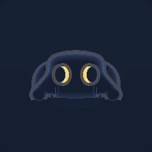 |
| kasumiutsubo | 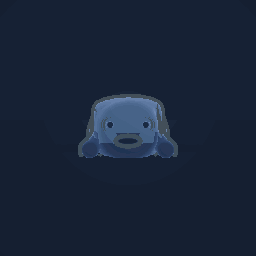 |
| katakunagani | 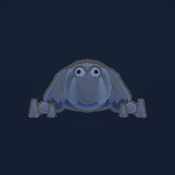 |
| kazaridaruma | 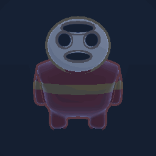 |
| kinokootoko | 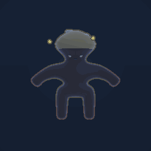 |
| kirimizuchi | 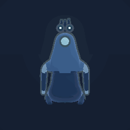 |
| kodamaNoNushi | 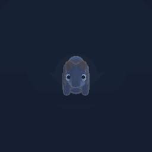 |
| kodamagitsune | 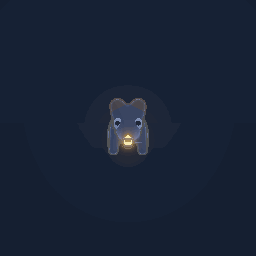 |
| kodamagumo | 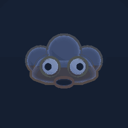 |
| kodamausagi | 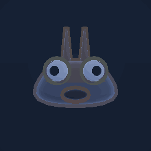 |
| mabutamushi | 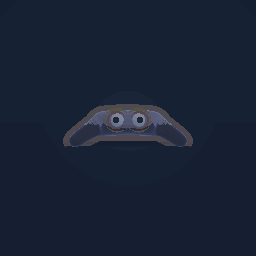 |
| madoromi | 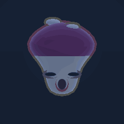 |
| madoromigumo | 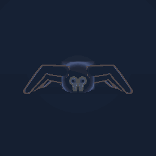 |
| matsurinonushi | 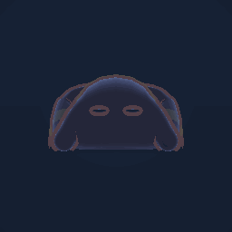 |
| mazarinezumi | 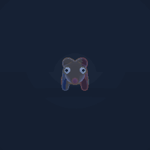 |
| menkaburikozo | 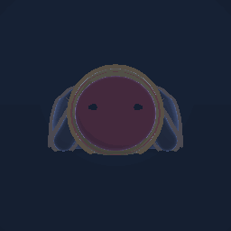 |
| misemonoNoNushi | 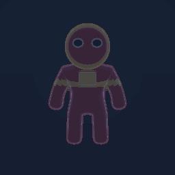 |
| mizukagami |  |
| mogurabaa |  |
| mouhitotsunokage |  |
| moyautsubo |  |
| nadakaze |  |
| nakimushi |  |
| namidaguma |  |
| nebosukegaeru |  |
| nedayamabiko |  |
| nemurimogura |  |
| nukarumigani |  |
| nushigaeru |  |
| oitekeboshi |  |
| okiyo |  |
| oomadoromi |  |
| oonebosuke |  |
| otama |  |
| otone |  |
| pochi |  |
| prop_barrel_bed |  |
| prop_hokoragi_a |  |
| prop_hokoragi_b |  |
| prop_hokoragi_stump |  |
| prop_quest_board |  |
| prop_shelf_barrel |  |
| prop_signpost |  |
| purun |  |
| scroll |  |
| shield |  |
| shioresakura |  |
| shizukuuo |  |
| staff |  |
| stairs |  |
| subetenopurun |  |
| surigarasu |  |
| tokoshiepurun |  |
| trap_alarm |  |
| trap_damage |  |
| trap_pitfall |  |
| trap_sleep |  |
| tsubute |  |
| urumiguma |  |
| wall |  |
| wasurebone |  |
| wasuregani |  |
| wasuremizuchi |  |
| wataamenoobake |  |
| yaguramori |  |
| yamabikogitsune |  |
| yamabikooni |  |
| yorishironozankyo |  |
| yoroimukade |  |
| yoroioiteke |  |
| yoseatsume |  |
| yumekuimogura |  |
| yumemayoinokage |  |
| yumemirupurun |  |
