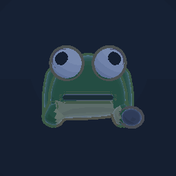

# モデルのエンジン内プレビュー

`tools/preview_engine.mjs`が自動生成する(手で編集しない)。
実際のゲームと同じ描画スタック(トゥーンマテリアル・輪郭線・
ポストプロセス)で撮っているので、ゲーム内の見た目と一致する
(plan/models/archive/engine-preview-snapshots.md)。

| モデル | 見た目 |
|---|---|
| tsubute |  |
